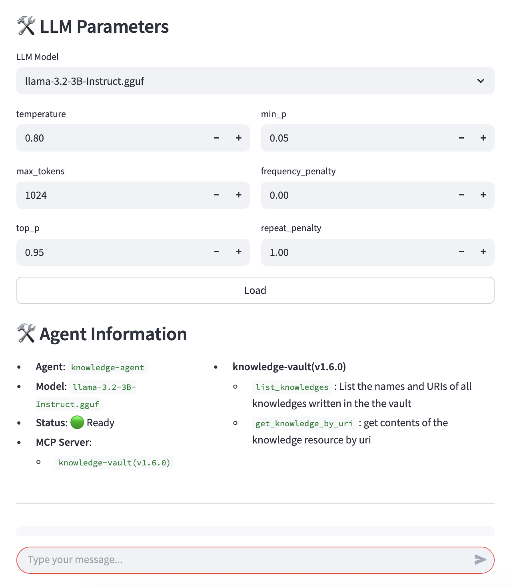
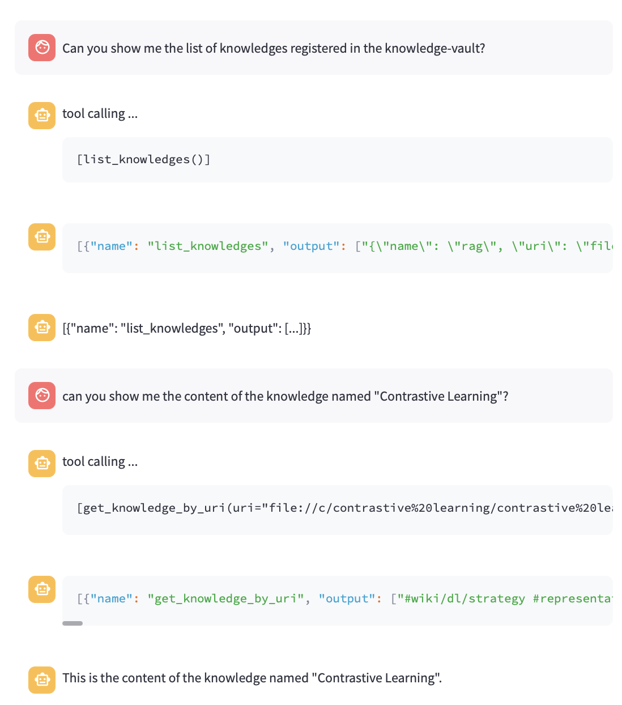

# MCP Obsidian Knowledge Base

**Note**: This is a fork of https://github.com/hjlee94/mcp-knowledge-base. I am making updates and changes to suit my needs and am maintaining this version. It may diverge a lot over time.

## Introduction

This repository is for building a private LLM agent that interfaces with an MCP client and server.

This repository includes the following components:
  * MCP Client
  * MCP Server
  * LLM Agent

The MCP server is designed to connect only to my private Obsidian knowledge base, which is organized using Markdown files.

For more details, please refer to this [Medium Article (How I built a local MCP server to connect Obsidian with AI)](https://medium.com/gitconnected/how-i-built-a-local-mcp-server-to-connect-obsidian-with-ai-55121295a985).

For the details of building sLLM agent and MCP client, please check this [Medium Article (How I built a Tool-calling Llama Agent with a Custom MCP Server)](https://medium.com/gitconnected/how-i-built-a-tool-calling-llama-agent-with-a-custom-mcp-server-3bc057d27e85).

## Components


### MCP Server (obsidian-vault)

The MCP server, named `obsidian-vault`, manages Markdown files that serve as topic-specific knowledge notes. It provides the following tools:

* `list_docs()` : list the names and URIs of all knowledges written in the the vault
* `get_doc_by_uri(uri:str)` : get contents of the knowledge resource by uri

It's tested with Claude Desktop.

### Agent / MCP Client

This repository also contains a simple LLM agent implementation. It currently uses the Llama 3.2 model and leverages the MCP client to retrieve relevant knowledge context.

### Chat Interface

The agent can be used via a chat interface built with Streamlit. Please note that it is a prototype and may contain bugs.

The following screenshots show LLM loading and parameter settings and the interactive chat view.

 

## Using the MCP Server

Ensure you've installed the `uv` package manager for Python system-wide.

Install dependencies:

```shell
uv sync
```

Create `config.json` in your project root and use it to specify your Obsidian vault path:
   ```json
   {
     "VAULT_PATH": "/path/to/your/obsidian/vault"
   }
   ```

On macOS if you're using iCloud as your sync method, you'll find the vault in:

```
  /Users/<YOUR_USERNAME>/Library/Mobile Documents/iCloud~md~obsidian/Documents/<YOUR_VAULT>"
```

Test the server by running:

```shell
uv run run_server.py
```

If you receive no errors, it's working as expected. Press `CTRL+C` to stop the server.

Configure the server in Claude by going to **Settings**, choosing **Developer**, and editing your configuration file. Add the following JSON to configure the server within Claude:

```
{
    "mcpServers": {
        "obsidian-vault": {
            "command": "uv",
            "args": [
                "--directory",
                "/Users/brianhogan/dev/mcp-knowledge-base",
                "run",
                "run_server.py"
            ]
        }
    }
}
```

You must specify the full path to your MCP server.

Restart Claude Desktop for the changes to apply.

